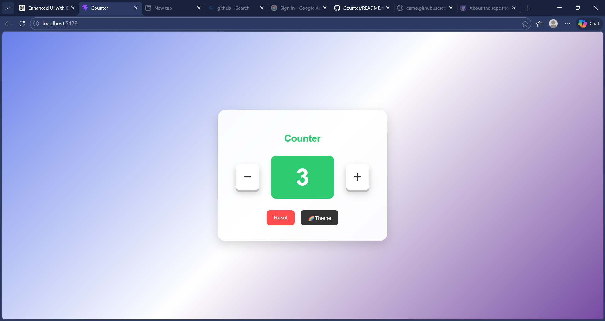

# Counter
A modern and interactive Counter App built using React with a clean UI, smooth animations, and multiple theme modes.
## 🚀 Features

* ➕ Increment & ➖ Decrement buttons (3D animated)
* 🔢 Dynamic counter display (changes color based on value)
* 🎨 3 Theme Modes:

  * 🌈 Gradient Mode
  * 🌙 Dark Mode
  * ⚪ Light Mode
* 🎉 Alert when count reaches 10
* ⌨️ Keyboard Controls:

  * `Arrow Up` → Increase
  * `Arrow Down` → Decrease
  * `R` → Reset
* 💅 Clean & modern UI design

---

## 🛠️ Tech Stack

* React.js
* CSS3 (Flexbox, Gradients, Animations)

---

## 📁 Project Structure

```
src/
 ├── App.jsx
 ├── style.css
```

---

## ▶️ How to Run

1. Clone the repository:

```
git clone https://github.com/v-ganjare/Counter.git
```

2. Navigate to project folder:

```
cd Counter
```

3. Install dependencies:

```
npm install
```

4. Run the app:

```
npm run dev
```

---

## 📸 Preview



---

## 💡 Future Improvements

* 🎊 Add confetti animation
* 🔊 Add sound effects
* 📊 Add history tracker
* 📱 Make fully responsive

---

## 🙌 Author

**Vaishnavii**


